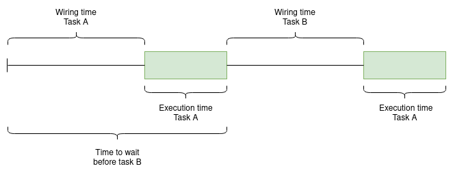
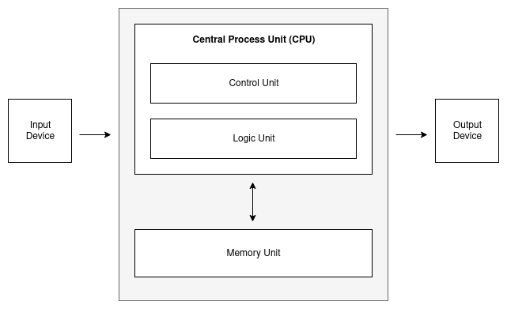

    >> DOCUMENT IN PROGRESS...
    >> DOKUMENTO EN PROGRESO...
    >> DOCUMENTO EN PROGRESO...

# Concurrency

## Una vision general
 
Concurrency es quizás uno de los tópicos más fascinante en Computer Science. La implementación de algoritmos concurrentes, además de su importancia práctica, representa un reto al ingenio y creatividad de cada Software Engineer.

El término Concurrency puede significar algo un tanto diferente en la mente de cada persona involucrada en tecnología. En una definición rapida y acotada:

**Concurrency es la capacidad de un algoritmo de lidiar con múltiples tareas, en un orden no determinístico, para completar su fin.**

Intentar explicar el concepto de concurrency en pocas palabras es todo un desafío. Como es posible explicar el concepto de concurrency sin hablar de *paralelismo*, *time sharing*, *Context Switching*, *thread*, *Multithreading*, *Hyperthreading*, *Multitasking*, *Multiuser*, etc.

## El viaje hacia concurrency

En 1943, la computadora Eniac requería ser configurada y recableada antes de ejecutar una nueva tarea especifica. El procedimiento necesario para ejecutar dos tareas A y B en Eniac podría representarse:

En este escenario, además del tiempo y esfuerzo necesario durante el proceso manual de recableado y configuración, es importante notar que: `Múltiples tareas esperan su turno para ser ejecutadas en un computador`. 

Con el objetivo de eliminar el proceso de cableado de Eniac, en 1949 la computadora EDVAC implementaria la **John Von Neumann Architecture**. Esta arquitectura, también llamada *Princeton architecture* se basa en el concepto de **stored-program computer**, en el cual las instrucción y datos de un programa son almacenados en *memoria*:

Donde:

* **Central Process Unit (CPU)**: responsable de ejecutar las instrucciones de un stored program. También llamado microprocesador o procesador. CPU incorpora *Arithmetic Logic Unit (ALU)*, *Control Unit (CU)* y *registers*

* **Registers**: almacenamiento de alta velocidad en la CPU donde se almacena la data a procesar.

* **Arithmetic and Logic Unit (ALU)**: Realiza operaciones aritméticas (sumar, restar, etc.) y lógicas (AND, OR, NOT, etc.).

* **Control Unit (CU)**: Controla las operaciones de la ALU, Memory y Inputs/Ouput según las intrucciones de los programas cargados desde la memoria.

* **Memory**: Dispositivo de almacenamiento accesible por la CPU.

En este punto, los *stored-programs computers* reemplazan por completo el proceso de configuracion por cableado, disminuyendo asi el tiempo necesario para ejecutar un programa.

En la década de 1950 los programadores solian escribir sus programas en punched card (tarjetas perforadas) para luego entregarlos a un equipo de operaciones el cual cargaba dichos programas de forma manual en la grandes y costosas computadoras de la epoca utilizando un *Input Devices* (*computer punched card reader* para el caso de targetas perforadas).

A medida que el numero de programas y velocidad de procesamiento de las computadoras aumentaba, el tiempo requerido por el operador para cargar un nuevo programa se transformó en *dead periods* (tiempo en el que la CPU no es utilizada). Tecnicas de Batch processing software fueron introducidad para reducir los tiempos de cargas de programas encolando aquellos listos para ser ejecutados.
