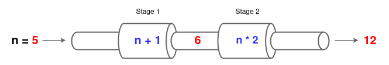

# Fan-out Fan-in

## Abstract

This docuements aims to introduce the **Fan-out Fan-in** pattern for a concurrent data processing pipelines and contrasting against a traditional secuential not concurrent design. Examples will be written in *Go Programing Languaje* given its natural nature and abstractions for bilding concurrent algorithms.

## Pipelines - Data Procesing 

A pipeline is a chain/serie of data processing elements, commonly known as *stages* which:

1. Take data in (inputs).
2. Perform an operation on the data (data processing).
3. Pass the data out (outputs).

Pipeline allows us to split our data processing flow in smaller and easy to test and maintain logical unit promoting:

* Separation of Cencenr
* Reusability of Stages and Functions.
* Single-responsibility principle.

## Designing a Pipeline

For practical purposes we are going to create an example of pipeline with simple stages. However, it is important to keep in mind that in a real world pipelines can perform complex bussines operations which even could involve relying on external services or systems.

Our example of pipeline will be able to process integers numbers. For each integer **n** processed by our pipeline the final out put will be equals to **(n+1) * 2**. In this way, we can define a pipeline with the next stages:

* **Stage 1**: Responsable for taking an integer **n** in, calculating **n + 1** and passing out the result.
* **Stage 2**: Responsable for taking an integer **n** in, calculating **n * 2** and passing out the result.

Diagram bellow reprecent our pipeline processing **n=5** and delivering the final output **12**

