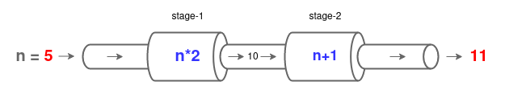

# Pipelines

A pipeline is a chain of data processing units(a.k.a.*stages*), arranged so the output of each unit is the ouput of the next one.

Pipeline allows to split complex data processing flows in smaller, testable and maintainable logical unit, promoting:

* Separation of Cencenr.
* Stages and functions reusability.
* Single-responsibility principle.

For example, the function f(n) = (n*2)+1 can be reprecented by a pipeline which chain two stages, as follow:



The *stage-1* takes the integer `5` in and calculates *n\*2*, then pass out the result `10` to the next *stage-2* which calculates *n+1* and pass out the final result `11`. Now, a simple implementation written in Golang.


```go
package main

import (
	"fmt"
	"time"
)

func multiply(x, y int) int {
	return x * y
}
func add(x, y int) int {
	return x + y
}
func main() {
	stage1 := func(n int) int {
		return multiply(n, 2)
	}
	stage2 := func(n int) int {
		return add(n, 1)
	}
	pipeline := func(n int) int {
		return stage2(stage1(n))
	}
	inputs := []int{1, 2, 3, 4, 5}
	for _, v := range inputs {
		fmt.Println(pipeline(v))
	}
}
```

Previous code may seems innocent, but the *for loop* is creating a new instance of our pipeline for each input element.
Imagine a scenery of massive amount of inputs (MBs or GBs), it would imply a massive recreation of our pipeline with a massive footprint of memory management in the HEAP.

In order to avoid recreating our pipeline for each input, the stage definitions of a pipeline can be extended to allow batch processing. For example:

```go
package main

import (
	"fmt"
	"time"
)

func multiply(x []int, y int) []int {
	for i, _ := range x {
		x[i] *= y
	}
	return x[:]
}
func add(x []int, y int) []int {
	for i, _ := range x {
		x[i] += y
	}
	return x[:]
}
func main() {
	stage1 := func(n []int) []int {
		return multiply(n, 2)
	}
	stage2 := func(n []int) []int {
		return add(n, 1)
	}
	pipeline := func(n []int) []int {
		return stage2(stage1(n))
	}
	inputs := []int{1, 2, 3, 4, 5}
	for _, v := range pipeline(inputs) {
		fmt.Println(v)
	}
}
```

However, bash processing introduce a new drawback and now all the elements have to be processed entirely by each stage before getting the final results.

**Golang Channels primitives** enables `stream data processing pipelines` and are considered *best practices* when implementing pipelines.
Goroutines interacting through an open channel avoid the need of recreating our pipeline for each input, and we can start getting results without the need of waiting for the full stream being processed.

Now, lets introduce the complete code for our stream data processing:

```go
package main

import (
	"context"
	"fmt"
	"time"
)

func multiply(done <-chan struct{}, stream <-chan int, y int) <-chan int {
	outputs := make(chan int)
	go func() {
		defer close(outputs)
		for v := range stream {
			select {
			case <-done:
				return
			case outputs <- v * y:
			}
		}
	}()
	return outputs
}

func add(done <-chan struct{}, stream <-chan int, y int) <-chan int {
	outputs := make(chan int)
	go func() {
		defer close(outputs)
		for v := range stream {
			select {
			case <-done:
				return
			case outputs <- v + y:
			}

		}
	}()
	return outputs
}

func readInputs(done <-chan struct{}, n int) <-chan int {
	stream := make(chan int)
	go func() {
		defer close(stream)
		for i := 1; i <= n; i++ {
			select {
			case <-done:
				return
			case stream <- i:
			}
		}
	}()
	return stream
}

func main() {
	stage1 := func(done <-chan struct{}, stream <-chan int) <-chan int {
		return multiply(done, stream, 2)
	}
	stage2 := func(done <-chan struct{}, stream <-chan int) <-chan int {
		return add(done, stream, 1)
	}
	pipeline := func(done <-chan struct{}, stream <-chan int) <-chan int {
		return stage2(done, stage1(done, stream))
	}

	const Timeout = 30 * time.Second
	ctx, cancel := context.WithTimeout(context.Background(), Timeout)
	defer cancel()

	const NroInputs = 100000
	inputs := readInputs(ctx.Done(), NroInputs)
	for v := range pipeline(ctx.Done(), inputs) {
		fmt.Println(v)
	}
}
```

About previous code:

* The expression `ctx, cancel := context.WithTimeout(context.Background(), Timeout)` defines a [done cancellation signal]() with a timeout of 30 seconds.
* Function `readInputs` receives a done cancellation signal and the number of inputs to produce (100,000 in this example)
* The pipeline processes discrete values.
* Each indiscrete value is obtained from the input stream and passed to our pipeline with out the need of creating a new instance achiving a low footsprint impact int the heap memory.
* No need to process the entire stream before getting results from the pipeline.

Finally, and for the sake of code style, here is a equivalent cleaner version:

```go
package main

import (
	"context"
	"fmt"
	"time"
)

func multiply(done <-chan struct{}, stream <-chan int, y int) <-chan int {
	outputs := make(chan int)
	go func() {
		defer close(outputs)
		for v := range stream {
			select {
			case <-done:
				return
			case outputs <- v * y:
			}
		}
	}()
	return outputs
}

func add(done <-chan struct{}, stream <-chan int, y int) <-chan int {
	outputs := make(chan int)
	go func() {
		defer close(outputs)
		for v := range stream {
			select {
			case <-done:
				return
			case outputs <- v + y:
			}

		}
	}()
	return outputs
}

func readInputs(done <-chan struct{}, n int) <-chan int {
	stream := make(chan int)
	go func() {
		defer close(stream)
		for i := 1; i <= n; i++ {
			select {
			case <-done:
				return
			case stream <- i:
			}
		}
	}()
	return stream
}

func main() {
	pipeline := func(done <-chan struct{}, stream <-chan int) <-chan int {
		return multiply(
			done,
			add(done, stream, 1),
			2,
		)
	}

	const Timeout = 30 * time.Second
	ctx, cancel := context.WithTimeout(context.Background(), Timeout)
	defer cancel()

	const NroInputs = 100000
	for v := range pipeline(ctx.Done(), readInputs(ctx.Done(), NroInputs)) {
		fmt.Println(v)
	}
}
```

## Conclusion

Stream data processing pipelines enables the processing of big sets of data throught easy evolve and maintain flows, provides a powerful alternative to improve the heap memory footprint of our software and enable preemptable data processing flows.
Nevertheless, it is important to be aware of implementing pipelines for small data set of inputs with a simple flow of processing can result in over engineering.